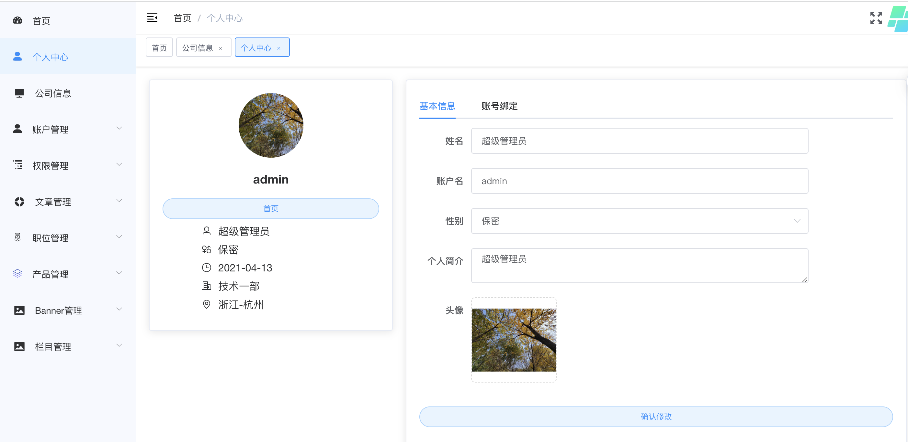
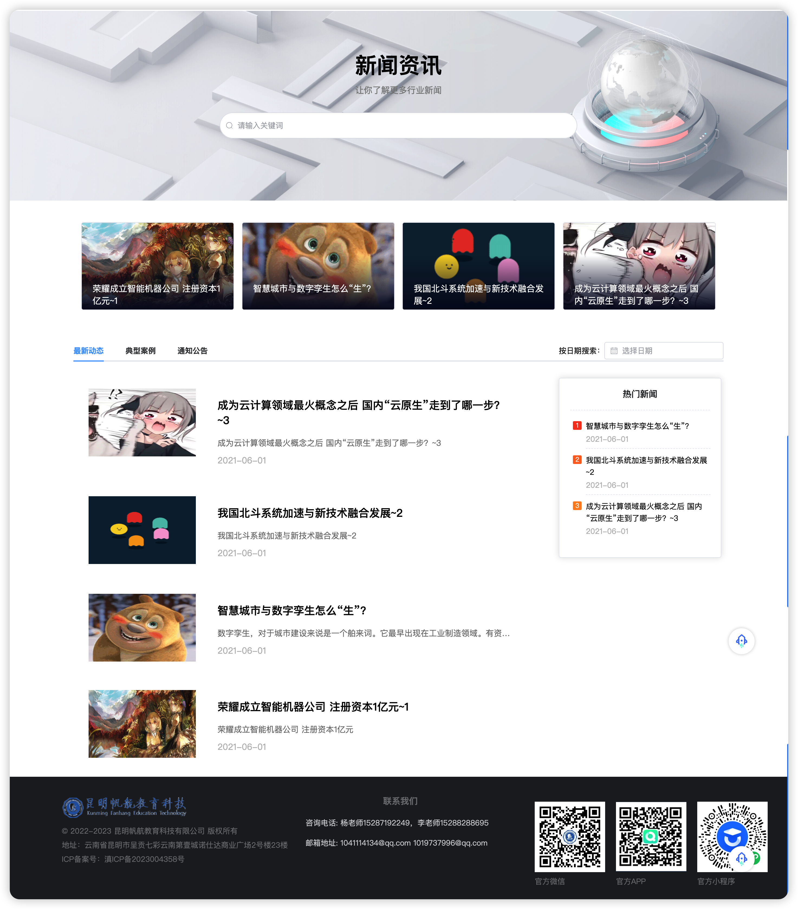

#                                 企业门户网站


## 一、采用技术方案

该系统采用的主要技术如下：
1. [Vue.js](https://cn.vuejs.org/)
2. [Element Plus](https://element-plus.gitee.io/zh-CN/)
3. [axios](http://www.axios-js.com/zh-cn/docs/index.html)
4. [node.js](https://nodejs.org/zh-cn/docs/)
5. [Sequelize](https://www.sequelize.com.cn/)
6. [Koa](https://koa.bootcss.com/)
7. minio

## 二、开发环境

1. 操作系统：Windows10
2. 数据库：MySQL 5.7
3. Web服务器：Nginx 
4. 开发工具：Webstorm
5. 系统基础环境：Node.js

## 三、目录说明

server---后端接口服务

admin---网站管理端



web---门户网站




## 四、演示地址

1. 企业门户：http://119.29.209.39:8100

2. 管理后台：http://119.29.209.39:8200  账号：admin，密码：123456

## 五、如何本地运行

1. 先启动后端(server目录下)
```bash
yarn install

npm run start(本地启动)

或者 npm run dev(实时监听改动重启，边改边跑) 需要全局安装 nodemon
```
2. 启动前端（web 或者 admin目录下）
```bash
# 1.安装
npm install / yarn install
# 2.启动
npm run dev / yarn dev
# 3.打包
npm run build / yarn build
# 4.清除 node_modules
npm run clear / yarn clear
```
yarn命令请提前全局安装
```bash
npm i yarn -g
```

## 六、补充说明

1.cd到各自的目录下跑，系统分为门户网站、管理后台，后端接口服务三个项目，根目录无法直接运行。

2.请严格检查自己的node版本。鉴于已经发现的问题，在windows环境下，建议使用node 14的大版本；mac系统 14和16都OK(运行在APPLE M1之上)。

3.如果数据库连接报错，请首先检查server(后端node)下config目录中的dbinfo.js的配置与你自己的数据库配置是否正确。

4.图片文件等上传的资源使用minio存储，请自行百度搭建minio。

## 七、咨询

杨先生：

邮箱：[1041114134@qq.com](mailto:835487894@qq.com)

手机：15287192249

微信号：FinelyYang
